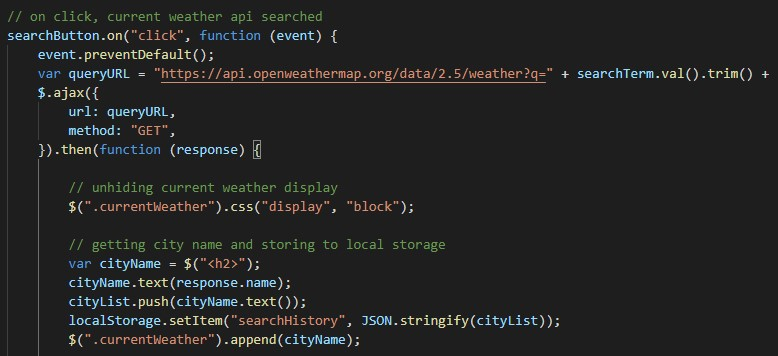
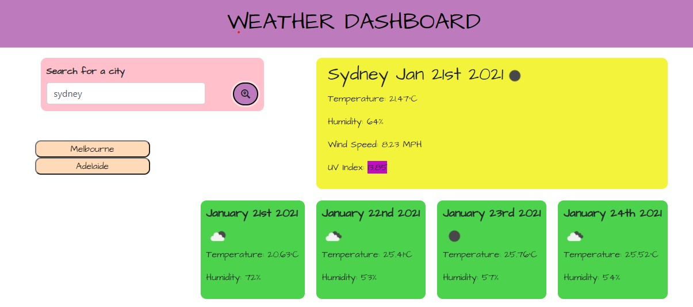

# Weather Dashboard

The aim of this project was to create a weather app that obtains its information from an API according to the city chosen by the user. To view this project, [click here!](https://silvia-taliana.github.io/weather-dashboard/)

## Installation

Three Open Weather API's were used for this project. The first one was to obtain current weather data, the second for the UV index and the third for a five day weather forecast. 

Below is the code calling the weather api when the search button is clicked.

The information required is taken from the URL containing the API. At the end of the URL, an API key is added to access this particular API. It is not always necessary to have an API key, but it is required to access some API's. The .then function ensures that the page does not load until the information from the API is loaded, otherwise the page will appear empty. The API URL also has the ability to input data from the user, which in this case, is the search term for the chosen city. This means that only the weather from that city will show on the page. 

The following shows how to choose the information that will be displayed on the dashboard: 

Here, the variables are creating new p elements to display the required content. The content is called from the API and then appended to the page. 

## Usage

Here is a representation of the weather dashboard: 

## License

Creative Commons Attribution 4.0 International Public License

MIT License